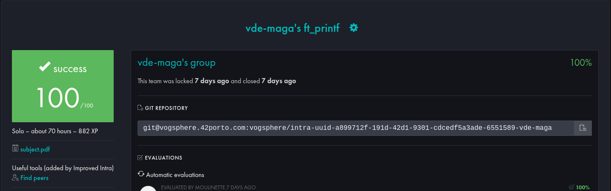

# 42 - printf

)

## About

> Recreating the printf function

## Evaluation

### Testing

- [WaRtr0/francinette-image](https://github.com/WaRtr0/francinette-image)
- [Tripouille/printfTester](https://github.com/Tripouille/printfTester)
